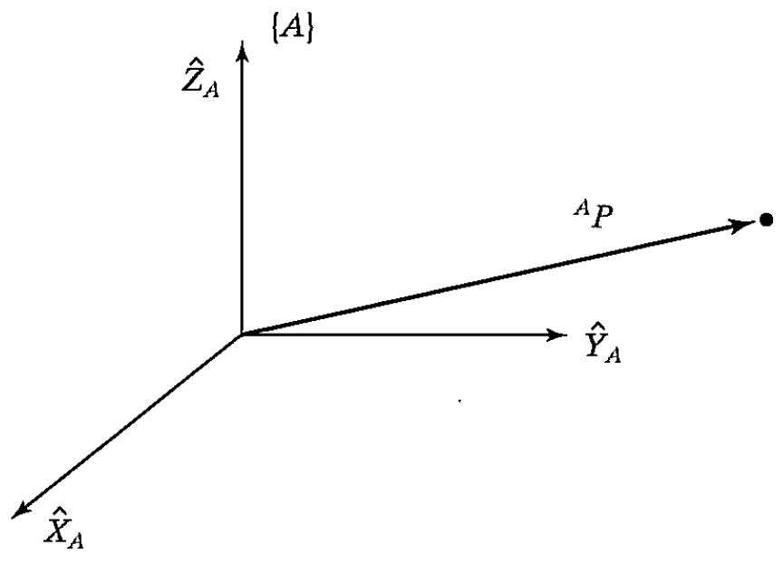

&emsp;
# Description of a position
Once a coordinate system is established, we can locate any point in the universe with a $3 \times 1$ position vector. 

Because we will often define many coordinate systems in addition to the universe coordinate system, vectors must be tagged with information identifying which coordinate system they are defined within. 

&emsp;
## Vector
In this book, vectors are written with a leading superscript 
$$P^A$$
- $A$: indicate the `coordinate system to which they are referenced` (unless it is clear from context)

This means that the components of $P^A$ have numerical values that indicate distances along the axes of $\{A\}$. Each of these distances along an axis can be thought of as the result of projecting the vector onto the corresponding axis.

    
    <h4>FIGURE 2.1: Vector relative to frame (example)</h>

&emsp;

Figure 2.1 pictorially represents a coordinate system, $\{A\}$, with three `mutually orthogonal unit vectors` with solid heads. 

$A$ point $P^A$ is represented as a vector and can equivalently be thought of as a position in space, or simply as an ordered set of three numbers. Individual elements of a vector are given the subscripts $x$, $y$, and $z$.

$$P^A = [p_x, p_y, p_z]^T \tag{2.1}$$

In summary, we will describe the `position` of a point in space with a position vector. 

Other 3-tuple descriptions of the position of points, such as 
- Spherical Coordinate Representations
- Cylindrical Coordinate Representations

are discussed in the exercises at the end of the chapter.
