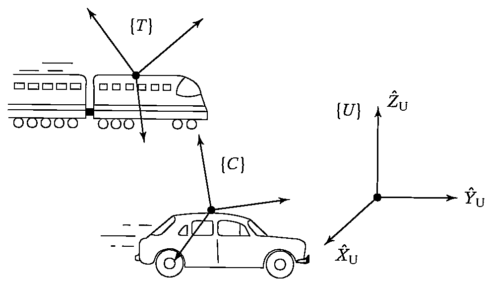

&emsp;
# Example 5.1

Figure 5.1 shows:
- $\{U\}$: fixed universe frame
- $\{T\}$: a frame attached to a train traveling at $100\ mph$
- $\{C\}$: a frame attached to a car traveling at $30\ mph$

    
    <h4>FIGURE 5.1: Example of some frames in linear motion</h>

&emsp;

Both vehicles are heading in the $\hat{X}$ direction of $\{U\}$. The rotation matrices, $R_{UT}$ and $R_{UC}$ are known and constant.

&emsp;
>$\frac{d}{dt}^U P^U_{C\ ORG}$

$$\frac{d}{dt}^U P^U_{C\ ORG} = V^U_{C\ ORG} = v_C = 30\hat{X}$$

&emsp;
>$(V^U_{T\ ORG})^C$

$$(V^U_{T\ ORG})^C = v^C_T = R_{CU} v_T = R_{CU}(100\hat{X}) = R^{-1}_{UC} 100\hat{X}$$

&emsp;
>$(V^T_{C\ ORG})^C$

$$(V^T_{C\ ORG})^C = R^T_{CT} V_{C\ ORG} = -R_{UC}^{-1}R_{UT}70\hat{X}$$

