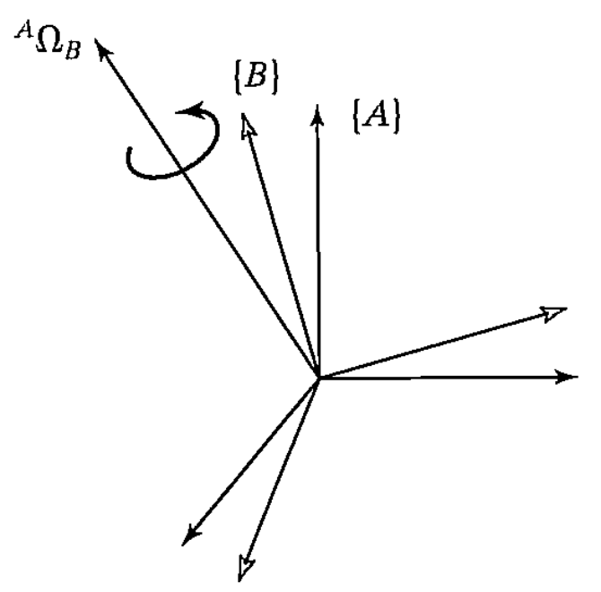

&emsp;
# The angular velocity vector
We now introduce an angular velocity vector, using the symbol $\Omega$ 
>Linear Velocity
- describes an attribute of a point
>Angular Velocity
- describes an attribute of a body

We always attach a frame to the bodies we consider, so we can also think of angular velocity as describing `rotational motion` of a frame.

    
    <h4>FIGURE 5.2</h>

&emsp;

In Fig. 5.2, ${}^A\Omega_B$ describes the rotation of frame $\{B\}$ relative to $\{A\}$. Physically, at any instant, 
- the `direction` of ${}^A\Omega_B$ indicates the instantaneous axis of rotation of $\{B\}$ relative to $\{A\}$
- the `magnitude` of ${}^A\Omega_B$ indicates the speed of rotation

Again, like any vector, an angular velocity vector may be expressed in any coordinate system, and so another leading superscript may be added; for example, $(\Omega^A_B)^C$ is the angular velocity of frame $\{B\}$ relative to $\{A\}$ expressed in terms of frame $\{C\}$.

    
    <h4>FIGURE 5.2: Frame {B} is rotating with angular velocity relative to frame {A}</h>

&emsp;

Again, we introduce a simplified notation for an important special case. This is simply the case in which there is an understood reference frame, so that it need not be mentioned in the notation:

$$\omega_C = {}^U\Omega_C \tag{5.6}$$

Here, is the angular velocity of frame $\{C\}$ relative to some understood reference frame, $\{U\}$. For example, ${}^A\omega_C$ is the angular velocity of frame $\{C\}$ expressed in terms of $\{A\}$ (though the angular velocity is with respect to $\{U\}$)