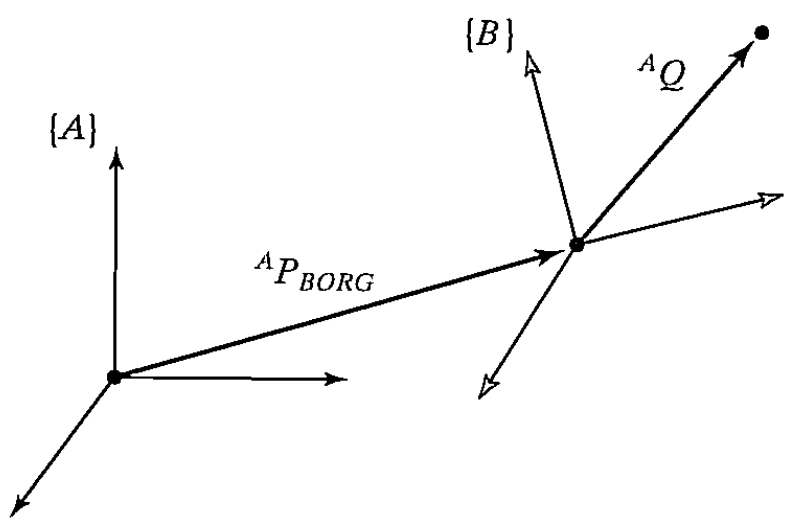

&emsp;
# Linear velocity
Consider a frame ${B}$ attached to a rigid body. We wish to describe the motion of $Q^B$ relative to frame ${A}$, as in Fig. 5.3. We may consider ${A}$ to be fixed.

    
    <h4>FIGURE 5.3: Frame {B} is translating with velocity A  relative to frame {A}</h>

&emsp;

Frame $\{B\}$ is located relative to (A), as described by a position vector, A and a rotation matrix, For the moment, we wifi assume that the orientation, is not changing with time—that is, the motion of point Q relative to $\{A\}$ is due to ApBORG or B Q changing in time.

Solving for the linear velocity of point Q in terms of (A) is quite simple. Just express both components of the velocity in terms of $\{A\}$, and sum them:

Equation (5.7) is for only that case in which relative orientation of $\{B\}$ and $\{A\}$ remains constant.

