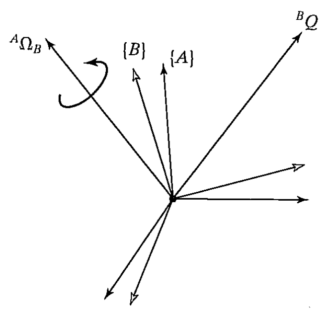
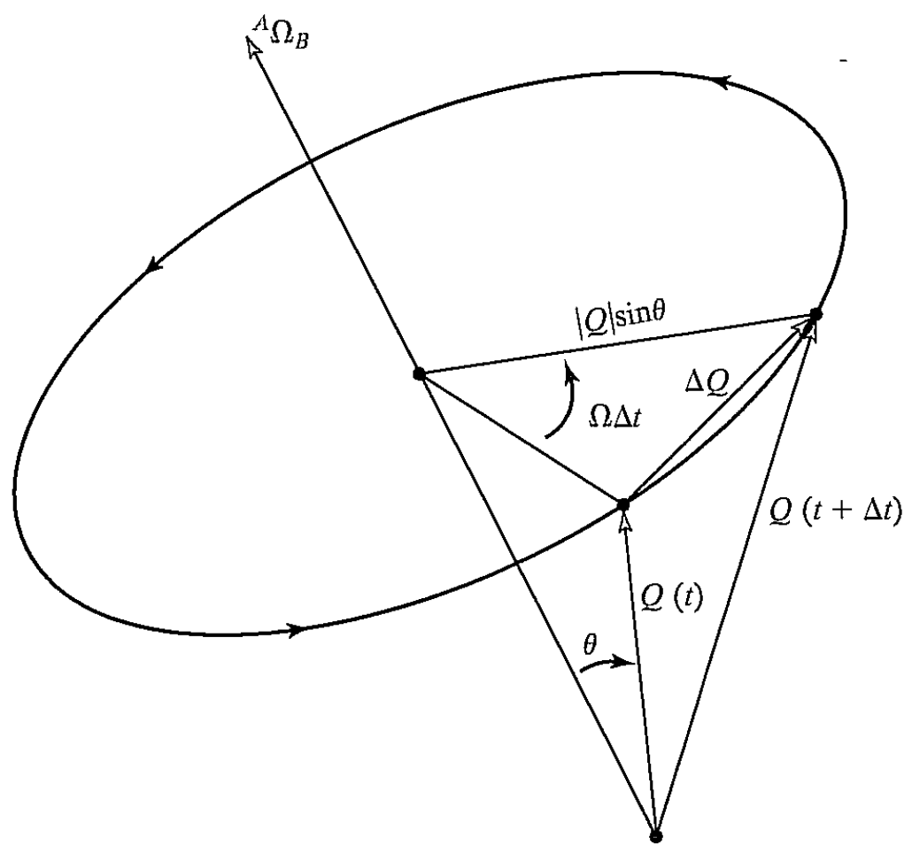

&emsp;
# Rotational velocity

Now let us consider two frames with coincident origins and with zero linear relative velocity; their origins will remain coincident for all time. One or both could be attached to rigid bodies, but, for clarity, the rigid bodies are not shown in Fig. 5.4.

The orientation of frame $\{B\}$ with respect to frame $\{A\}$ is changing in time.
- ${}^A\Omega_B$: rotational velocity of $\{B\}$ relative to {A} 
- ${}^BQ$: a vector that locates a point fixed in $\{B\}$. 

    
    <h4>FIGURE 5.4</h>

&emsp;

Now we consider the all-important question: 
- How does ${}^BQ$ change with time as viewed from $\{A\}$ when it is fixed in $\{B\}$ and the systems are rotating?

Let us consider that the vector $Q$ is constant as viewed from frame $\{B\}$; that is,

$${ }^B V_Q=0 $$

Even though it is constant relative to $\{B\}$, it is clear that point $Q$ will have a velocity as seen from $\{A\}$ that is due to the rotational velocity ${ }^A \Omega_B$. 

To solve for the velocity of point $Q$, we will use an intuitive approach. 

&emsp;
## Solve the Problem
Figure 5.5 shows two instants of time as vector $Q$ rotates around ${ }^A \Omega_B$. This is what an observer in $\{A\}$ would observe.

    
    <h4>FIGURE 5.5: The velocity of a point due to an angular velocity</h>

&emsp;

By examining Fig. $5.5$, we can figure out both the `direction` and the `magnitude` of the change in the vector as viewed from $\{A\}$. 
- First, it is clear that the differential change in ${}^A Q$, that is $\Delta Q$, must be perpendicular to both ${}^A \Omega_B$ and ${}^A Q$
- Second, we see from Fig. 5.5 that the magnitude of the differential change is
    $$|\Delta Q|=\left(\left.\right|^A Q \mid \sin \theta\right)\left(\left.\right|^A \Omega_B \mid \Delta t\right) \tag{5.9}$$

&emsp;
## Cross Product

These conditions on magnitude and direction immediately suggest the `vector crossproduct`. Indeed, our conclusions about direction and magnitude are satisfied by the computational form

$${ }^A V_Q={}^A \Omega_B \times{ }^A Q \tag{5.10}$$

&emsp;
## Final Equation
In the general case, the vector $Q$ could also be changing with respect to frame $\{B\}$, so, adding this component, we have

$${}^A V_Q={ }^A\left({}^B V_Q\right)+{}^A \Omega_B \times{ }^A Q \tag{5.11}$$

Using a rotation matrix to remove the dual-superscript, and noting that the description of ${ }^A Q$ at any instant is ${ }_B^A R^B Q$, we end with

$${}^A V_Q={ }_B^A R{ }^B V_Q+{ }^A \Omega_B \times{ }_B^A R{ }^B Q \tag{5.12}$$