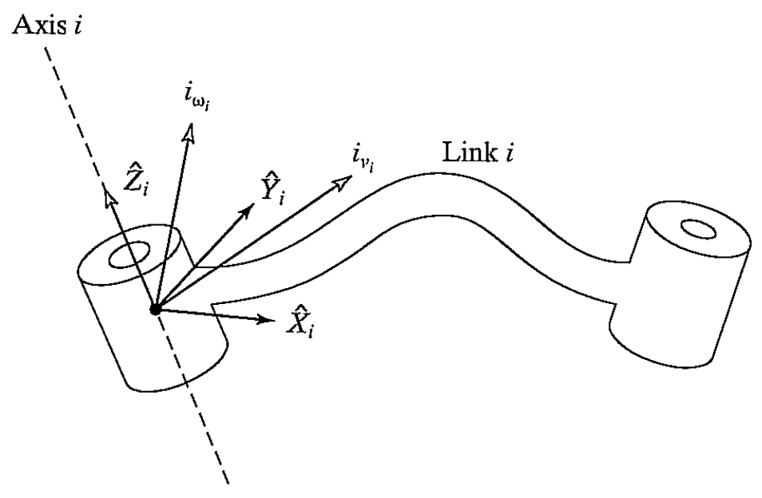
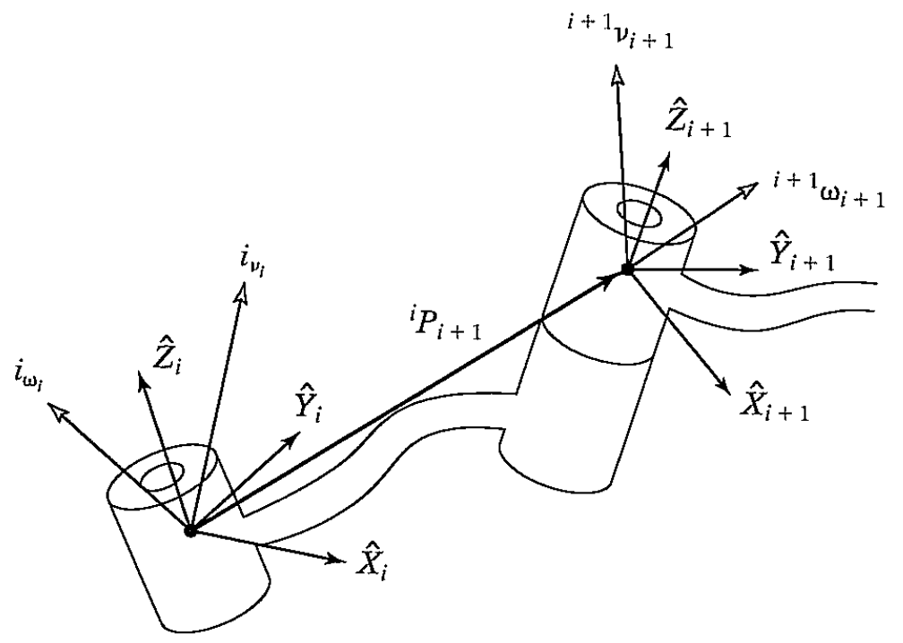

&emsp;
# VELOCITY "PROPAGATION" FROM LINK TO LINK

We now consider the problem of calculating the linear and angular velocities of the links of a robot. A manipulator is a chain of bodies, each one capable of motion relative to its neighbors. Because of this structure, we can compute the velocity of each link in order, starting from the base. 

The velocity of link $i + 1$ will be that of link $i$, plus whatever new velocity components were added by joint $i + 1$

    
    <h4>FIGURE 5.6</h>

&emsp;

As indicated in Fig. 5.6, let us now think of each link of the mechanism as a rigid body with linear and angular velocity vectors describing its motion. Further, we will express these velocities with respect to the link frame itself rather than with respect to the base coordinate system. 

Figure 5.7 shows links $i$ and $i + 1$, along with their velocity vectors defined in the link frames.

    
    <h4>FIGURE 5.7: Velocity vectors of neighboring links</h>

&emsp;

Rotational velocities can be added when both $\omega$ vectors are written with respect to the same frame. Therefore, the angular velocity of link $i + 1$ is the same as that of link $i$ plus a new component caused by rotational velocity at joint $i+1$. This can be written in terms of frame $\{i\}$ as

$${ }^i \omega_{i+1}={ }^i \omega_i+{ }_{i+1}^i R \dot{\theta}_{i+1}{ }^{i+1} \hat{Z}_{i+1} \tag{5.43}$$

Note that
$$\dot{\theta}_{i+1}{ }^{i+1} \hat{Z}_{i+1}={ }^{i+1}\left[\begin{array}{c}0 \\0 \\ \dot{\theta}_{i+1}
\end{array}\right] \tag{5.44}$$

We have made use of the rotation matrix relating frames $\{i\}$ and $\{i+1\}$ in order to represent the added rotational component due to motion at the joint in frame $\{i\}$. The rotation matrix rotates the axis of rotation of joint $i+1$ into its description in frame $\{i\}$, so that the two components of angular velocity can be added.

By premultiplying both sides of $(5.43)$ by ${ }_i^{i+1} R$ we can find the description of the angular velocity of link $i+1$ with respect to frame $\{i+1\}$ :

$${ }^{i+1} \omega_{i+1}={ }_i^{i+1} R^i \omega_i+\dot{\theta}_{i+1}{ }^{i+1} \hat{Z}_{i+1} \tag{5.45}$$

The linear velocity of the origin of frame $\{i+1\}$ is the same as that of the origin of frame $\{i\}$ plus a new component caused by rotational velocity of link $i$. This is exactly the situation described by (5.13), with one term vanishing because ${ }^i P_{i+1}$ is constant in frame $\{i\}$. Therefore, we have

$${ }^i v_{i+1}={ }^i v_i+{ }^i \omega_i \times{ }^i P_{i+1} \tag{5.46}$$

Premultiplying both sides by ${ }_i^{i+1} R$, we compute
$${ }^{i+1} v_{i+1}={ }^{i+1} R\left({ }^i v_i+{ }^i \omega_i \times{ }^i P_{i+1}\right) \tag{5.47}$$

Equations $(5.45)$ and $(5.47)$ are perhaps the most important results of this chapter. The corresponding relationships for the case that joint $i+1$ is prismatic are

$$\begin{aligned}
{ }^{i+1} \omega_{i+1} & ={ }_i^{i+1} R{ }^i \omega_i, \\
{ }^{i+1} v_{i+1} & ={ }_i^{i+1} R\left({ }^i v_i+{ }^i \omega_i \times{ }^i P_{i+1}\right)+\dot{d}_{i+1}{ }^{i+1} \hat{Z}_{i+1} .
\end{aligned} \tag{5.48}$$

Applying these equations successively from link to link, we can compute ${ }^N \omega_N$ and ${ }^N v_N$, the rotational and linear velocities of the last link. Note that the resulting velocities are expressed in terms of frame $\{N\}$. This turns out to be useful, as we will see later. If the velocities are desired in terms of the base coordinate system, they can be rotated into base coordinates by multiplication with ${ }_N^0 R$.