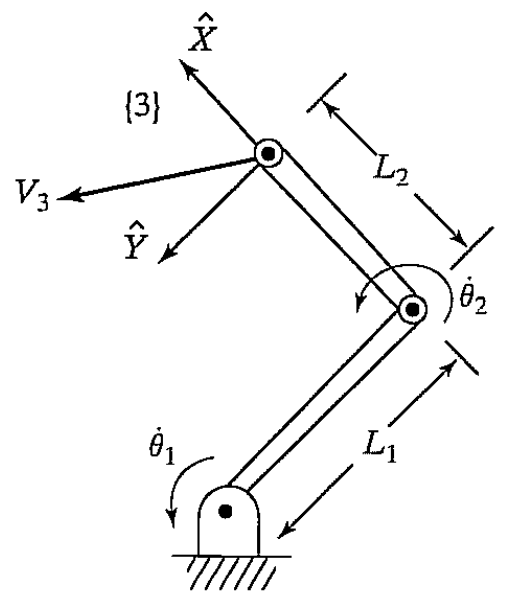
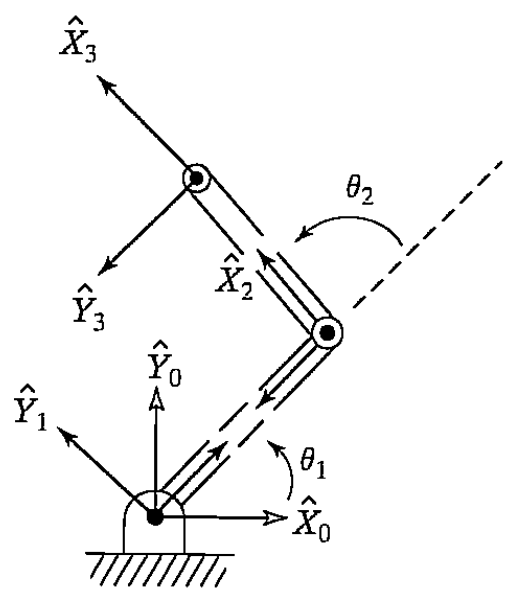

&emsp;
# Example 5.3

A two-link manipulator with rotational joints is shown in Fig. 5.8. Calculate the velocity of the tip of the arm as a function of joint rates. Give the answer in two forms -in terms of frame $\{3\}$ and also in terms of frame $\{0\}$.

    
    <h4>FIGURE 5.8: A two-link manipulator</h>

&emsp;

Frame $\{3\}$ has been attached at the end of the manipulator, as shown in Fig. 5.9, and we wish to find the velocity of the origin of this frame expressed in frame $\{3\}$. 

    
    <h4>FIGURE 5.9: Frame assignments for the two-link manipulator</h>

&emsp;

As a second part of the problem, we will express these velocities in frame $\{0\}$ as well. We will start by attaching frames to the links as we have done before (shown in Fig. 5.9).

We will use $(5.45)$ and $(5.47)$ to compute the velocity of the origin of each frame, starting from the base frame $\{0\}$, which has zero velocity. Because (5.45) and (5.47) will make use of the link transformations, we compute them:

$$\begin{aligned}
& { }_1^0 T=\left[\begin{array}{cccc}
c_1 & -s_1 & 0 & 0 \\
s_1 & c_1 & 0 & 0 \\
0 & 0 & 1 & 0 \\
0 & 0 & 0 & 1
\end{array}\right], \\
& { }_2^1 T=\left[\begin{array}{cccc}
c_2 & -s_2 & 0 & l_1 \\
s_2 & c_2 & 0 & 0 \\
0 & 0 & 1 & 0 \\
0 & 0 & 0 & 1
\end{array}\right], \\
& { }_3^2 T=\left[\begin{array}{llll}
1 & 0 & 0 & l_2 \\
0 & 1 & 0 & 0 \\
0 & 0 & 1 & 0 \\
0 & 0 & 0 & 1
\end{array}\right] 
\end{aligned} \tag{5.49}$$

Note that these correspond to the manipulator of Example 3.3 with joint 3 permanently fixed at zero degrees. The final transformation between frames $\{2\}$ and $\{3\}$ need not be cast as a standard link transformation (though it might be helpful to do so). Then, using (5.45) and (5.47) sequentially from link to link, we calculate

$$\begin{aligned}
{ }^1 \omega_1 & =\left[\begin{array}{l}
0 \\ 0 \\ \dot{\theta}_1
\end{array}\right] &(5.50) \\
{ }^1 v_1 & ={\left[\begin{array}{l}
0 \\ 0 \\ 0
\end{array}\right] } &(5.51)\\
{ }^2 \omega_2 &= {\left[\begin{array}{c}
0 \\ 0 \\
\dot{\theta}_1+\dot{\theta}_2
\end{array}\right] } &(5.52)\\
{ }^2 v_2&= {\left[\begin{array}{ccc}
c_2 & s_2 & 0 \\
-s_2 & c_2 & 0 \\
0 & 0 & 1
\end{array}\right]\left[\begin{array}{c}
0 \\
l_1 \dot{\theta}_1 \\
0
\end{array}\right]=\left[\begin{array}{c}
l_1 s_2 \dot{\theta}_1 \\
l_1 c_2 \dot{\theta}_1 \\ 0
\end{array}\right] } &(5.53)\\
{ }^3 \omega_3 &={ }^2 \omega_2, &(5.54) \\
{ }^3 v_3 &=  {\left[\begin{array}{cc}
l_1 s_2 \dot{\theta}_1 \\
l_1 c_2 \dot{\theta}_1+l_2\left(\dot{\theta}_1+\dot{\theta}_2\right) \\
0
\end{array}\right] }&(5.55)
\end{aligned}$$

Equation (5.55) is the answer. Also, the rotational velocity of frame $\{3\}$ is found in (5.54).

To find these velocities with respect to the nonmoving base frame, we rotate them with the rotation matrix ${ }_3^0 R$, which is

$${ }_3^0 R={ }_1^0 R \quad{ }_2^1 R \quad{ }_3^2 R=\left[\begin{array}{ccc}
c_{12} & -s_{12} & 0 \\
s_{12} & c_{12} & 0 \\
0 & 0 & 1\end{array}\right] \tag{5.56}$$

This rotation yields
$${ }^0 v_3=\left[\begin{array}{c}
-l_1 s_1 \dot{\theta}_1-l_2 s_{12}\left(\dot{\theta}_1+\dot{\theta}_2\right) \\
l_1 c_1 \dot{\theta}_1+l_2 c_{12}\left(\dot{\theta}_1+\dot{\theta}_2\right) \\
0
\end{array}\right] \tag{5.57}$$