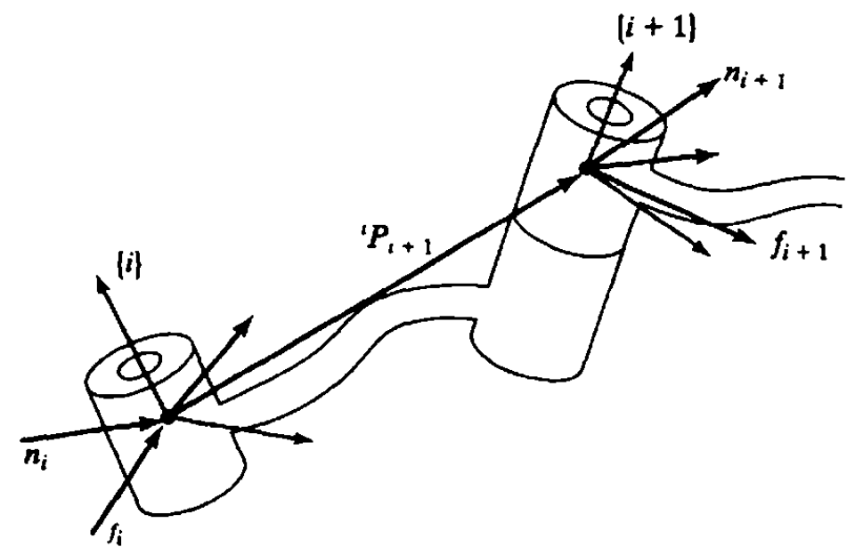

&emsp;
# STATIC FORCES IN MANIPULATORS

The chainlike nature of a manipulator leads us quite naturally to consider how forces and moments "propagate" from one link to the next. Typically, the robot is pushing on something in the environment with the chain's free end (the end-effector) or is perhaps supporting a load at the hand. We wish to solve for the joint torques that must be acting to keep the system in static equilibrium.

In considering static forces in a manipulator, we first lock all the joints so that the manipulator becomes a structure. We then consider each link in this structure and write a force-moment balance relationship in terms of the link frames. Finally, we compute what static torque must be acting about the joint axis in order for the manipulator to be in static equilibrium. In this way, we solve for the set of joint torques needed to support a static load acting at the end-effector.

In this section, we will not be considering the force on the links due to gravity(that will be left until chapter 6). The static forces and torques we are considering at the joints are those caused by a static force or torque (or both) acting on the last link-for example, as when the manipulator has its end-effector in contact with the environment.

We define special symbols for the force and torque exerted by a neighbor link:
- $f_i=$ force exerted on link $i$ by link $i-1$,
- $n_i=$ torque exerted on link $i$ by link $i-1$.

We will use our usual convention for assigning frames to links. Figure $5.11$ shows the static forces and moments (excluding the gravity force) acting on link $i$. 

    
    <h4>FIGURE 5.11: Static force-moment balance for a single link</h>

&emsp;

Summing the forces and setting them equal to zero, we have
$${ }^i f_i-{ }^i f_{i+1}=0 \tag{5.76}$$

Summing torques about the origin of frame $\{i\}$, we have
$${ }^i n_i-{ }^i n_{i+1}-{ }^i P_{i+1} \times{ }^i f_{i+1}=0 \tag{5.77}$$

If we start with a description of the force and moment applied by the hand, we can calculate the force and moment applied by each link, working from the last link down to the base (link 0). To do this, we formulate the force-moment expressions (5.76) and (5.77) such that they specify iterations from higher numbered links to lower numbered links. The result can be written as

$$\begin{aligned}
{ }^i f_i & ={ }^i f_{i+1} & (5.78)\\
{ }^i n_i & ={ }^i n_{i+1}+{ }^i P_{i+1} \times{ }^i f_{i+1} & (5.79)
\end{aligned}$$

In order to write these equations in terms of only forces and moments defined within their own link frames, we transform with the rotation matrix describing frame $\{i+1\}$ relative to frame $\{i\}$. This leads to our most important result for static force "propagation" from link to link:
$$\begin{aligned}
& { }^i f_i={ }_{i+1}^i R^{i+1} f_{i+1}, & (5.80)\\
& { }^i n_i={ }_{i+1}^i R^{i+1} n_{i+1}+{ }^i P_{i+1} \times{ }^i f_i & (5.81)
\end{aligned}$$

Finally, this important question arises: What torques are needed at the joints in order to balance the reaction forces and moments acting on the links? All components of the force and moment vectors are resisted by the structure of the mechanism itself, except for the torque about the joint axis. Therefore, to find the joint torque required to maintain the static equilibrium, the dot product of the joint-axis vector with the moment vector acting on the link is computed:
$$
\tau_i={ }^i n_i^{T i} \hat{Z}_i \tag{5.82}$$
In the case that joint $i$ is prismatic, we compute the joint actuator force as
$$
\tau_i={ }^i f_i^{T i} \hat{Z}_i \tag{5.83}$$

Note that we are using the symbol $\tau$ even for a linear joint force.

As a matter of convention, we generally define the positive direction of joint torque as the direction which would tend to move the joint in the direction of increasing joint angle.

Equations (5.80) through (5.83) give us a means to compute the joint torques needed to apply any force or moment with the end-effector of a manipulator in the static case.

