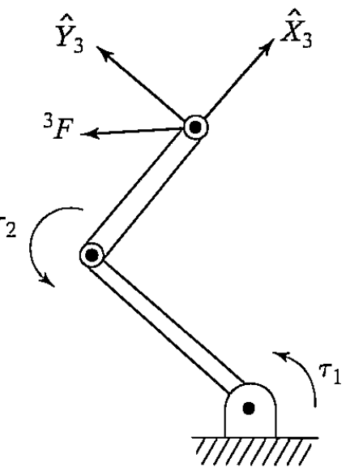

&emsp;
# Example 5.2

The two-link manipulator of Example 5.3 is applying a force vector 3F with its end-effector. (Consider this force to be acting at the origin of {3}.) Find the required joint torques as a function of configuration and of the applied force. (See Fig. 5.12.)

    
    <h4>FIGURE 5.12: A two-link manipulator applying a force at its tip</h>

&emsp;

We apply Eqs. (5.80) through (5.82), starting from the last link and going toward the base of the robot:

$$\begin{aligned}
& { }^2 f_2=\left[\begin{array}{c}
f_x \\ f_y \\ 0
\end{array}\right] & (5.84)\\
& { }^2 n_2=l_2 \hat{X}_2 \times\left[\begin{array}{c}
f_x \\ f_y \\ 0
\end{array}\right]=\left[\begin{array}{c}
0 \\ 0 \\ l_2 f_y
\end{array}\right] & (5.85)\\
& { }^1 f_1=\left[\begin{array}{ccc}
c_2 & -s_2 & 0 \\
s_2 & c_2 & 0 \\
0 & 0 & 1
\end{array}\right]\left[\begin{array}{c}
f_x \\ f_y \\ 0
\end{array}\right]=\left[\begin{array}{c}
c_2 f_x-s_2 f_y \\ s_2 f_x+c_2 f_y \\ 0
\end{array}\right] & (5.86)\\
& { }^1 n_1=\left[\begin{array}{c}
0 \\0 \\ l_2 f_y
\end{array}\right]+l_1 \hat{X}_1 \times{ }^1 f_1=\left[\begin{array}{c}
0 \\0 \\ l_1 s_2 f_x+l_1 c_2 f_y+l_2 f_y
\end{array}\right] & (5.87)
\end{aligned}$$

Therefore, we have
$$\begin{aligned}
\tau_1 & =l_1 s_2 f_x+\left(l_2+l_1 c_2\right) f_y & (5.88)\\
\tau_2 & =l_2 f_y & (5.89)
\end{aligned}$$

This relationship can be written as a matrix operator:
$$\tau=\left[\begin{array}{cc}
l_1 s_2 & l_2+l_1 c_2 \\
0 & l_2
\end{array}\right]\left[\begin{array}{l}
f_x \\ f_y
\end{array}\right] \tag{5.90}$$

It is not a coincidence that this matrix is the transpose of the Jacobian that we found in (5.66)!

$${ }^3 J(\Theta)=\left[\begin{array}{cc}
l_1 s_2 & 0 \\
l_1 c_2+l_2 & l_2
\end{array}\right] \tag{5.66}$$
