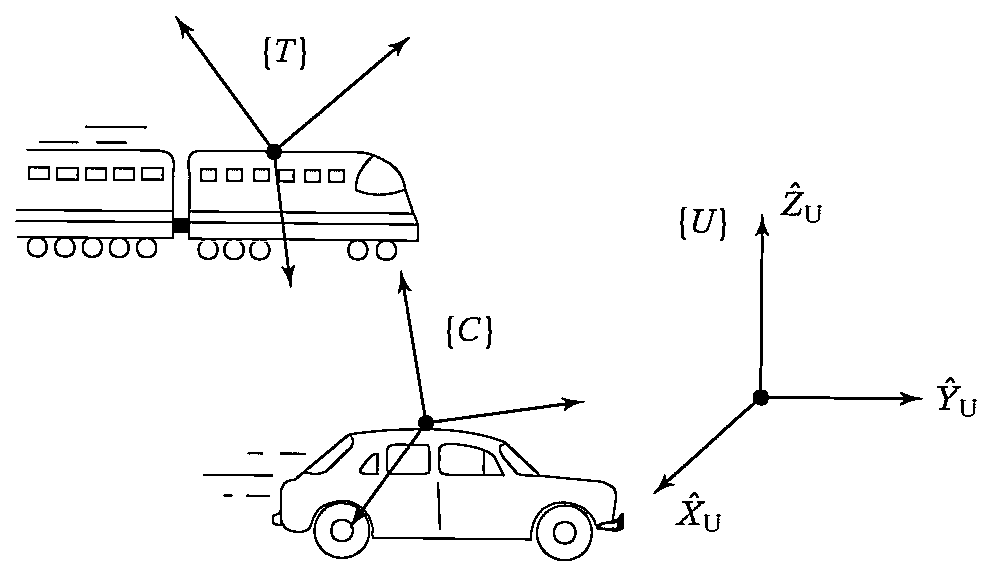

&emsp;
# Example 5.1

Figure 5.1 shows:
- $\{U\}$: fixed universe frame
- $\{T\}$: a frame attached to a train traveling at $100\ mph$
- $\{C\}$: a frame attached to a car traveling at $30\ mph$

    
    <h4>FIGURE 5.1: Example of some frames in linear motion</h>

&emsp;

Both vehicles are heading in the $\hat{X}$ direction of $\{U\}$. The rotation matrices, ${}^U_TR$ and ${}^U_CR$ are known and constant.

&emsp;
>${}^U\frac{d}{dt}\ {}^UP_{C\ ORG}$

$$
\frac{{ }^U d}{d t}{ }^U P_{C\ O R G}={ }^U V_{C\ O R G}=v_C=30 \hat{X}
$$

&emsp;
>${ }^C\left({ }^U V_{T\ O R G}\right)$

$$
{ }^C\left({ }^U V_{T\ O R G}\right)={ }^C v_T={ }_U^C R v_T={ }_U^C R(100 \hat{X})={ }_C^U R^{-1}\ 100 \hat{X}
$$

&emsp;
>${ }^C\left({ }^T V_{C\ O R G}\right)$

$${ }^C\left({ }^T V_{C\ O R G}\right)={ }_T^C R\ {}^TV_{C\ O R G}=-{ }_C^U R^{-1}\ { }_T^U R\ 70 \hat{X} $$

