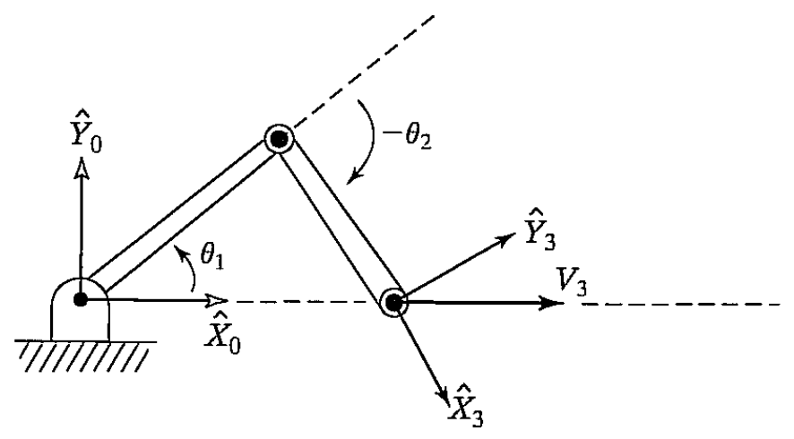

&emsp;
# Example 5.5

    
    <h4>FiGURE 5.10: A two-link manipulator moving its tip at a constant linear velocity</h>

&emsp;

Consider the two-link robot from Example 5.3 as it is moving its end-effector along the $\hat{X}$ axis at $1.0 \mathrm{~m} / \mathrm{s}$, as in Fig. 5.10 . Show that joint rates are reasonable when far from a singularity, but that, as a singularity is approached at $\theta_2=0$, joint rates tend to infinity.
We start by calculating the inverse of the Jacobian written in $\{0\}$ :
$${}^0J^{-1}(\Theta)=\frac{1}{l_1 l_2 s_2}\left[\begin{array}{cc}
l_2 c_{12} & l_2 s_{12} \\
-l_1 c_1-l_2 c_{12} & -l_1 s_1-l_2 s_{12}
\end{array}\right] \tag{5.74}$$

Then, using Eq. $(5.74)$ for a velocity of $1 \mathrm{~m} / \mathrm{s}$ in the $\hat{X}$ direction, we can calculate joint rates as a function of manipulator configuration:

$$\begin{aligned}
& \dot{\theta}_1=\frac{c_{12}}{l_1 s_2}, \\
& \dot{\theta}_2=-\frac{c_1}{l_2 s_2}-\frac{c_{12}}{l_1 s_2} 
\end{aligned} \tag{5.75}$$

Clearly, as the arm stretches out toward $\theta_2=0$, both joint rates go to infinity.

