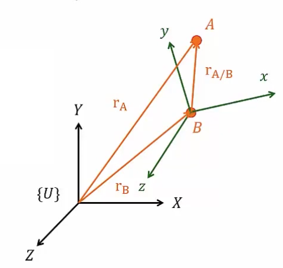
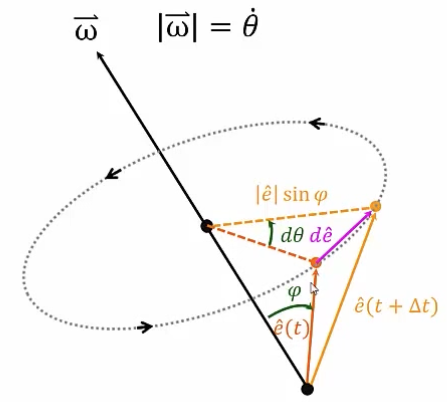
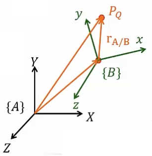

&emsp;
# Rigid Body Motion
## Intro
$$
\overrightarrow{r_A} =x_A \hat{I}+y_{A} \hat{J} 
$$

    

$\overrightarrow{r_A}$ 看成两个向量相加
$$ \begin{aligned}
\overrightarrow{r_A}& =\overrightarrow{r}_B+\overrightarrow{r}_{A / B} \\
& =\left(x_{B} \hat{I}+y_{B} \hat{J}\right)+\left(x_{A / B} \hat{I}+y_{A / B} \hat{J}\right) \end{aligned}$$

$\overrightarrow{r_{A / B}}$ 用 $\{B\}$ 坐标系的单位向量表示

$$\begin{aligned}
\overrightarrow{r_A}& =\overrightarrow{r}_B+\overrightarrow{r_{A / B}} \\

& =\left(x_{B} \hat{I}+y_{B} \hat{J}\right)+\left(x_{A / B} \hat{i}+y_{A / B} \hat{j}\right)
\end{aligned}
$$

速度
$$\begin{aligned}
\overrightarrow{v_{A}} & =\dot{\overrightarrow{r}_{A}}=\dot{x_A \hat{I}}+\dot{y_A \hat{J}} \\
& =\dot{\overrightarrow{r}_{B}}+\dot{\overrightarrow{r_{A / B}}}\end{aligned}$$

因为 $\hat{I}、\hat{J}$ 在 $U$ 对地坐标下, 方向、大小都不变, 所以求导后为 $0$
$$\begin{aligned}
\overrightarrow{v_{A}} & =\left(\dot{x_B} \hat{I}+\dot{y_B} \hat{J}\right)+
\left(\dot{x_{A / B}} \hat{I}+\dot{y_{A / B}} \hat{J}\right)
\end{aligned}$$

现在把 $\{B\}$ 坐标系加入表达的话, 就需要把 $\dot{x_{A / B} \hat{I}}+\dot{y_{A / B} \hat{J}}$ 展开, 根据 $\dot{uv} = \dot{u}v + u\dot{v}$ 得
$$\dot{x_{A / B} \hat{I}}+\dot{y_{A / B} \hat{J}} =
\left(\dot{x_{A / B}} \hat{I}+\dot{y_{A/ B}} \hat{J}\right) +
\left(x_{A / B} \dot{\hat{I}}+y_{A/ B} \dot{\hat{J}}\right) 
$$

其中
$$
\left(x_{A / B} \dot{\hat{I}}+y_{A/ B} \dot{\hat{J}}\right) =
x_{A / B}(\vec{\omega} \times \hat{i})+y_{A / B}(\vec{\omega} \times \hat{j})
$$

接下来分析一下为什么 $\left(x_{A / B} \dot{\hat{I}}+y_{A/ B} \dot{\hat{J}}\right) =
x_{A / B}(\vec{\omega} \times \hat{i})+y_{A / B}(\vec{\omega} \times \hat{j})$

 

&emsp;

>Magnitude
$$
\begin{aligned}
|d \hat{e}| & =|\hat{e}| \sin \varphi d \theta \\
|\frac{d \hat{e}}{dt}| & =|\hat{e}| \sin \varphi \frac{d \theta}{dt}\\
|\dot{\hat{e}}| & =|\hat{e}| \sin \varphi \dot{\theta}=|\hat{e}||\vec{\omega}| \sin \varphi
\end{aligned}
$$

>Direction
$$\begin{aligned}
& d \hat{e} \perp \hat{e} \\
& d \hat{e} \perp \vec{\omega} \\
& \dot{\hat{e}}=\vec{\omega} \times \hat{e}
\end{aligned}$$

>最后整合式子

 

$$\begin{aligned}
\overrightarrow{v_{A}} &=\left(\dot{x_{B}} \hat{I}+\dot{y_B} \hat{J}\right)+\left(\dot{x_{A / B}} \hat{l}+ \dot{y_{A / B}} \hat{J}\right) + \vec{\omega} \times\left(x_{A / B} \hat{i}+y_{A / B} \hat{j}\right) \\
& =\left(\dot{x_{B}} \hat{I}+\dot{y_B} \hat{J}\right)+\left(\dot{x_{A / B}} \hat{l}+ \dot{y_{A / B}} \hat{J}\right) + \vec{\omega} \times\left(x_{A / B} \hat{I}+y_{A / B} \hat{J}\right)
\end{aligned}$$
- 最后一项的意思是, 可以用两个不同的坐标系去表达, 一般用后面那个式子

>将式子简化一下
$$
\overrightarrow{v_{A}}=\overrightarrow{v_B}+\overrightarrow{v_{r e l}}+\vec{\omega} \times \overrightarrow{r_{A / B}}
$$
- 只有 $\overrightarrow{v_{r e l}}$ 是相对速度, 其它的都是在 $\{U\}$ 下表示

>将这些公式一般化

 

$$
{ }^A V_Q={ }^A V_{B \text { ORG }}+{ }_B^A R{ }^B V_Q+{ }^A \Omega_B \times{ }_B^A R{ }^B P_Q
$$

