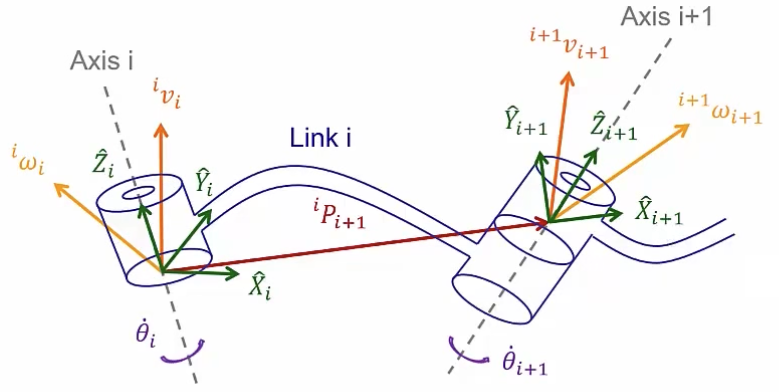

&emsp;
# Velocity Propagation
## 1 回顾 DH Model
Strategy: Represent linear and angular velocities of link $i$ in frame $\{i\}$, and find their relationship to those of neighboring links

    

&emsp;

## 2 Rotational Joint

    

&emsp;

## 2.1 Angular velocity propagation
$$
{ }^i \omega_{i+1}={ }^i \omega_i+{ }_{i+1}^i R \dot{\theta}_{i+1}{ }^{i+1} \hat{Z}_{i+1}
$$

因为是绕着 $Z$ 轴转动, 所以
$$
\dot{\theta}_{i+1}{ }^{i+1} \hat{Z}_{i+1}={}^{i+1}\left[\begin{array}{c}
0 \\ 0 \\ \dot{\theta}_{i+1}
\end{array}\right]
$$

${ }^i \omega_{i+1}$ 左乘 ${ }_i^{i+1} R$ 得到下面
>角速度迭代式

$$
{ }^{i+1} \omega_{i+1}={ }^{i+1}_i R\ {}^i \omega_i+\dot{\theta}_{i+1}{ }^{i+1} \hat{Z}_{i+1}
$$

&emsp;
## 2.2 Linear velocity propagation
$$
{ }^i v_{i+1}={ }^i v_i+{ }^i \omega_i \times{ }^i P_{i+1}
$$

${ }^i v_{i+1}$ 左乘 ${ }_i^{i+1} R$ 得到下面
>线速度迭代式
$$
{ }^{i+1} v_{i+1}={ }^{i+1} R\left({ }^i v_i+{ }^i \omega_i \times{ }^i P_{i+1}\right)
$$

&emsp;
## 3 Prismatic joint

## 3.1 Angular velocity propagation
$$
{ }^i \omega_{i+1}={ }^i \omega_i
$$

${ }^i \omega_{i+1}$ 左乘 ${ }_i^{i+1} R$ 得到下面
>角速度迭代式
$$
{ }^{i+1} \omega_{i+1}={ }^{i+1}_i R\ { }^i \omega_i
$$

## 3.2 Linear velocity propagation
$$
{ }^i v_{i+1}=\left({ }^i v_i+{ }^i \omega_i \times{ }^i P_{i+1}\right)+{ }_{i+1}^i R\ \dot{d}_{i+1}{ }^{i+1} \hat{Z}_{i+1}
$$

其中

$$
\dot{d}_{i+1}{ }^{i+1} \hat{Z}_{i+1}=\left[\begin{array}{c}
0 \\0 \\\dot{d}_{i+1}
\end{array}\right]
$$

${ }^i v_{i+1}$ 左乘 ${ }_i^{i+1} R$ 得到下面
>线速度迭代式
$$
{ }^{i+1} v_{i+1}={ }_i^{i+1} R\left({ }^i v_i+{ }^i \omega_i \times{ }^i P_{i+1}\right)+\dot{d}_{i+1}{ }^{i+1} \hat{Z}_{i+1}
$$