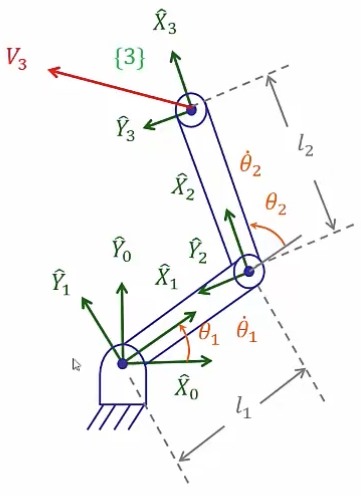

&emsp;
# Example - RR

## Method 1: Velocity "Propagation" from Link to Link

    

&emsp;

$$
\begin{aligned}
{ }_1^0 T & =\left[\begin{array}{cccc}
c_1 & -s_1 & 0 & 0 \\
s_1 & c_1 & 0 & 0 \\
0 & 0 & 1 & 0 \\
0 & 0 & 0 & 1
\end{array}\right] \\
{ }_2^1 T & =\left[\begin{array}{cccc}
c_2 & -s_2 & 0 & l_1 \\
s_2 & c_2 & 0 & 0 \\
0 & 0 & 1 & 0 \\
0 & 0 & 0 & 1
\end{array}\right] \\
{ }_3^2 T & =\left[\begin{array}{llll}
1 & 0 & 0 & l_2 \\
0 & 1 & 0 & 0 \\
0 & 0 & 1 & 0 \\
0 & 0 & 0 & 1
\end{array}\right]
\end{aligned}
$$

## Link "propagation"
>Link 1
$${ }^1 \omega_1={ }_0^1 R{ }^0 \omega_0+\dot{\theta}_1{ }^1 \hat{Z}_1=\dot{\theta}_1{ }^1 \hat{Z}_1=\left[\begin{array}{c}
0 \\ 0 \\ \dot{\theta}_1
\end{array}\right]$$

$${ }^1 v_1={ }_0^1 R\left({ }^0 v_0+{ }^0 \omega_0 \times{ }^0 P_1\right)=\left[\begin{array}{l}
0 \\ 0 \\ 0
\end{array}\right]$$

>Link 2
$${ }^2 \omega_2={ }_1^2 R{ }^1 \omega_1+\dot{\theta}_2{ }^2 \hat{Z}_2=\left[\begin{array}{c}
0 \\ 0 \\ \dot{\theta}_1+\dot{\theta}_2
\end{array}\right]$$

$${}^2v_2={ }_1^2 R\left({ }^1 v_1+{ }^1 \omega_1 \times{ }^1 P_2\right)=\left[\begin{array}{ccc}
c_2 & s_2 & 0 \\ -s_2 & c_2 & 0 \\ 0 & 0 & 1
\end{array}\right]\left[\begin{array}{c}
0 \\ l_1 \dot{\theta}_1 \\ 0
\end{array}\right]=\left[\begin{array}{c}
l_1 s_2 \dot{\theta}_1 \\ l_1 c_2 \dot{\theta}_1 \\ 0
\end{array}\right]
$$

>Link 3
$${ }^3 \omega_3={ }^2 \omega_2$$

$$
\begin{aligned}
{ }^3 v_3 & ={ }_2^3 R\left({ }^2 v_2+{ }^2 \omega_2 \times{ }^2 P_3\right) \\
& =I\left(\left[\begin{array}{c}
l_1 s_2 \dot{\theta}_1 \\
l_1 c_2 \dot{\theta}_1 \\
0
\end{array}\right]+\left[\begin{array}{c}
0 \\
0 \\
\dot{\theta}_1+\dot{\theta}_2
\end{array}\right] \times\left[\begin{array}{c}
l_1 \\
0 \\
0
\end{array}\right]\right) \\
& =\left[\begin{array}{c}
l_1 s_2 \dot{\theta}_1 \\
l_1 c_2 \dot{\theta}_1+l_2\left(\dot{\theta}_1+\dot{\theta}_2\right) \\
0
\end{array}\right]
\end{aligned}
$$

>Link 3 在地坐标下
$$
\begin{aligned}
{ }^0 v_3= & { }_3^0 R{ }^3 v_3=\left[\begin{array}{c}
-l_1 s_1 \dot{\theta}_1-l_2 s_{12}\left(\dot{\theta}_1+\dot{\theta}_2\right) \\
l_1 c_1 \dot{\theta}_1+l_2 s_{12}\left(\dot{\theta}_1+\dot{\theta}_2\right) \\
0
\end{array}\right] \\
& ={ }_1^0 R_2^1 R_3^2 R \\
& =\left[\begin{array}{ccc}
c_{12} & -s_{12} & 0 \\
s_{12} & c_{12} & 0 \\
0 & 0 & 1
\end{array}\right]
\end{aligned}
$$

Therefore
$$\begin{aligned}
{ }^3 \boldsymbol{v}=\left[\begin{array}{c}
v_x \\ v_y \\ \omega
\end{array}\right] & =\left[\begin{array}{cc}
l_1 s_2 & 0 \\
l_1 c_2+l_2 & l_2 \\
1 & 1
\end{array}\right]\left[\begin{array}{c}
\dot{\theta}_1 \\
\dot{\theta}_2
\end{array}\right] \\
& ={ }^3 J(\Theta) \dot{\Theta}
\end{aligned}$$

$$\begin{aligned}
& \operatorname{det}\left|\begin{array}{cc}
l_1 s_2 & 0 \\
l_1 c_2+l_2 & l_2
\end{array}\right|=l_1 l_2 s_2=0 \\
& \Rightarrow \theta_2=0 \text { or } 180
\end{aligned}$$

$$\begin{aligned}
{ }^0 \boldsymbol{v}=\left[\begin{array}{c}
v_x \\ v_y \\ \omega
\end{array}\right] & =\left[\begin{array}{cc}
-l_1 s_1-l_2 s_{12} & -l_2 s_{12} \\
l_1 c_1+l_2 c_{12} & l_2 c_{12} \\
1 & 1
\end{array}\right]\left[\begin{array}{c}
\dot{\theta}_1 \\
\dot{\theta}_2
\end{array}\right] \\
& ={ }^0 J(\Theta) \dot{\Theta}
\end{aligned}$$

&emsp;
## Method 2: Direct differentiation
$${ }^0\left[\begin{array}{c}
p_x \\ p_y \\ \theta
\end{array}\right]=\left[\begin{array}{c}
l_1 c_1+l_2 c_{12} \\
l_1 s_1+l_2 s_{12} \\
\theta_1+\theta_2
\end{array}\right]$$

做微分之后

$$
\begin{aligned}
{\left[\begin{array}{c}
v_x \\
v_y \\
\omega
\end{array}\right] } & =\left[\begin{array}{c}
-l_1 s_1 \dot{\theta}_1-l_2 s_{12}\left(\dot{\theta}_1+\dot{\theta}_2\right) \\
l_1 c_1 \dot{\theta}_1+l_2 s_{12}\left(\dot{\theta}_1+\dot{\theta}_2\right) \\
\dot{\theta}_1+\dot{\theta}_2
\end{array}\right] \\
& =\left[\begin{array}{cc}
-l_1 s_1-l_2 s_{12} & -l_2 s_{12} \\
l_1 c_1+l_2 c_{12} & l_2 c_{12} \\
1 & 1
\end{array}\right]\left[\begin{array}{c}
\dot{\theta}_1 \\
\dot{\theta}_2
\end{array}\right]
\end{aligned}
$$
$$\Downarrow$$
$$\dot{X}={ }^0 J(\Theta) \dot{\Theta}$$

- Note: NO $3 \times 1$ orientation vector whose derivative is  $\omega$
