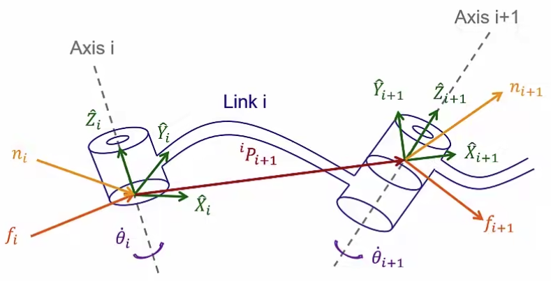

&emsp;
# Static Forces
When considering static forces
- Lock all the joints
- Write force-moment relationship
- Compute static torque (ignore gravity)

    

&emsp;

$$\begin{array}{lc}
{ }^i f_i={ }^i f_{i+1} & { }^i 
n_i={ }^i n_{i+1}+{ }^i P_{i+1} \times{ }^i f_{i+1} \\ \\
\Downarrow {}_{i+1} ^i R & \Downarrow {}_{i+1} ^i R \\ \\
{ }^i f_i={ }_{i+1}^i R\ {}^{i+1} f_{i+1} & 
{ }^i n_i={ }_{i+1}^i R\ {}^{i+1} n_{i+1}+{ }^i P_{i+1} \times{ }^i f_i
\end{array}
$$

The joint toque required to maintain the static equilibrium

- Revolute joint
$$
\tau_i={ }^i n_i^T\ { }^i \widehat{Z}_i
$$
- Prismatic joint
$$
\tau_i={ }^i f_i^T\ { }^i \widehat{Z}_i
$$