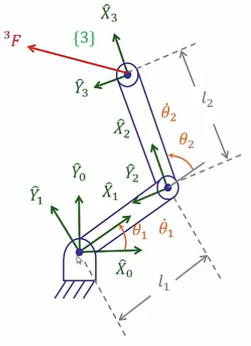

&emsp;
# Example RR 

    

&emsp;

$${ }^2 f_2={ }_3^2 R^3 f_3=I^3 F=\left[\begin{array}{c}
f_x \\ f_y \\ 0
\end{array}\right]$$

$${ }^2 n_2={ }_3^2 R\ {}^3 n_3+{ }^2 P_3 \times{ }^2 f_2=\left[\begin{array}{c}
0 \\ 0 \\ l_2 f_y
\end{array}\right]$$

$$\begin{aligned}
{ }^1 f_1={ }_2^1 R\ {}^2 f_2 & =\left[\begin{array}{ccc}
c_2 & -s_2 & 0 \\ s_2 & c_2 & 0 \\ 0 & 0 & 1
\end{array}\right]\left[\begin{array}{c}
f_x \\ f_y \\ 0
\end{array}\right] \\
& =\left[\begin{array}{c}
c_2 f_x-s_2 f_y \\ s_2 f_x+c_2 f_y \\ 0
\end{array}\right]
\end{aligned}$$

$${ }^1 n_1={ }_2^1 R\ {}^2 n_2+{ }^1 P_2 \times{ }^2 f_2=\left[\begin{array}{c}
0 \\ 0 \\ l_1 s_2 f_x+l_1 c_2 f_y+l_2 f_y
\end{array}\right]$$

Therefore,
$$
\begin{aligned}
& \tau_1={ }^1 n_1^T\ { }^1 \widehat{Z_1}=l_1 s_2 f_x+\left(l_2+l_1 c_2\right) f_y \\
& \tau_2={ }^2 n_2^T\ \widehat{Z_2}=l_2 f_y \\
& \Rightarrow \tau=\left[\begin{array}{cc}
l_1 s_2 & l_2+l_1 c_2 \\
0 & l_2
\end{array}\right]\left[\begin{array}{l}
f_x \\
f_y
\end{array}\right]
\end{aligned}
$$