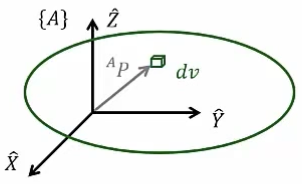

&emsp;
# Mass Distribution

## Inertia tensor
Inertia tensor relative to frame $\{A\}$
$${ }^A I=\left[\begin{array}{ccc}
I_{x x} & -I_{x y} & -I_{x z} \\
-I_{x y} & I_{y y} & -I_{y z} \\
-I_{x z} & -I_{y z} & I_{z z}
\end{array}\right]$$

    

&emsp;

>Mass moment of inertia > 0
$$
\begin{aligned}
& I_{x x}=\iiint_V\left(y^2+z^2\right) \rho d v \\
& I_{y y}=\iiint_V\left(x^2+z^2\right) \rho d v \\
& I_{z z}=\iiint_V\left(x^2+y^2\right) \rho d v
\end{aligned}
$$

>Mass product of inertia
$$
\begin{aligned}
& I_{x y}=\iiint_V x y \rho d v \\
& I_{x z}=\iiint_V x z \rho d v \\
& I_{y z}=\iiint_V y z \rho d v
\end{aligned}
$$

- Constant real symmetric matrix (orthogonally diagonalizable) 
    - its eigendecomposition (i. e., $M=V \Lambda V^{-1}$ )对角化
    $$
    { }^A I=\left[\begin{array}{ccc}
    I_{x x} & -I_{x y} & -I_{x z} \\
    -I_{x y} & I_{y y} & -I_{y z} \\
    -I_{x z} & -I_{y z} & I_{z z}
    \end{array}\right]=R\left[\begin{array}{ccc}
    I_{X X} & 0 & 0 \\
    0 & I_{Y Y} & 0 \\
    0 & 0 & I_{Z Z}
    \end{array}\right] R^T
    $$

- $I_{x x}+I_{y y}+I_{z z}=\operatorname{trace}\left({ }^A I\right)=$ constant
    - Trace is invariant under a similarity transformation
- If xy-plane is plane of symmetry, then $I_{x z}=I_{y z}=0$

&emsp;
## Parallel-axis Theorem

Computing how the inertia tensor changes under translations of the reference coordinate system

$$
\begin{aligned}
& { }^A I_{z z}={ }^C I_{z z}+m\left(x_c{ }^2+y_c{ }^2\right) \\
& { }^A I_{x y}={ }^C I_{x y}-m x_c y_c
\end{aligned}
$$
- C: at COM of the body
- A: arbitrary frame

Vector-matrix form

$$
{ }^A I={ }^C I+m\left[P_c^T P_c I_3-P_c P_c^T\right] \quad P_c=\left[\begin{array}{lll}
x_c & y_c & z_c
\end{array}\right]^T
$$
