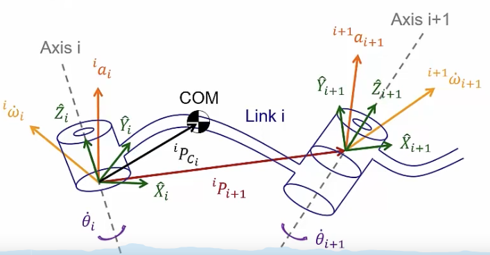

&emsp;
# Acceleration Propagation

    

&emsp;

>Newton's equation
$$F=\frac{d}{d t}\left(m v_C\right)=m \dot{v}_C$$
- $I$: Even if using inertial frame, it can change during motion
>Euler's equation
$$N=\frac{d}{d t}(I \omega)$$
- C: body frame, whose origin is located at COM 
- ${ }^c I$ : constant matrix

&emsp;
## 1 Rotational Joint (Link i+1)
Strategy: Represent linear and angular accelerations of link $i$ in frame $\{i\}$, and find their relationship to those of neighboring links

    

&emsp;

>Angular acceleration propagation In Chap 5
$${ }^i \omega_{i+1}={ }^i \omega_i+{ }_{i+1}^i R\ \dot{\theta}_{i+1}{ }^{i+1} \hat{Z}_{i+1},\quad 其中\ \dot{\theta}_{i+1}{ }^{i+1} \hat{Z}_{i+1}={}^{i+1}\left[\begin{array}{c}0 \\0 \\\dot{\theta}_{i+1}
\end{array}\right]$$

$$\Downarrow diff$$

$${ }^i \dot{\omega}_{i+1}={ }^i \dot{\omega}_i+{ }^i \omega_i \times{ }_{i+1}^i R \dot{\theta}_{i+1}{ }^{i+1} \hat{Z}_{i+1}+{ }_{i+1}^i R \ddot{\theta}_{i+1}{ }^{i+1} \hat{Z}_{i+1}$$

$$\Downarrow left \times {}^{i+1}_i R$$

$${ }^{i+i} \dot{\omega}_{i+1}={ }^{i+1} R{ }^i \dot{\omega}_i+{ }^{i+1} R^{\triangleright}{ }^i \omega_i \times \dot{\theta}_{i+1}{ }^{i+1} \hat{Z}_{i+1}+\ddot{\theta}_{i+1}{ }^{i+1} \hat{Z}_{i+1}$$

>Linear acceleration propagation

$${ }^i a_{i+1}={ }^i a_i+{ }^i \dot{\omega}_i \times{ }^i P_{i+1}+{ }^i \omega_i \times\left({ }^i \omega_i \times{ }^i P_{i+1}\right)$$

$$\Downarrow {}^{i+1}_i R$$

$${ }^{i+1} a_{i+1}={ }^{i+1}_i R\left({ }^i a_i+{ }^i \dot{\omega}_i \times{ }^i P_{i+1}+{ }^i \omega_i \times\left({ }^i \omega_i \times{ }^i P_{i+1}\right)\right)$$

&emsp;
## 2 Prismatic joint (Link i+1)
>Angular acceleration propagation
$${ }^i \dot{\omega}_{i+1}={ }^i \dot{\omega}_i \stackrel{{ }_i^{i+1} R}{\longrightarrow}{ }^{i+1} \dot{\omega}_{i+1}={ }^{i+1} R{ }^i \dot{\omega}_i$$

>Linear acceleration propagation

$$\begin{array}{r}
{ }^i a_{i+1}={ }^i a_i+{ }^i \dot{\omega}_i \times{ }^i P_{i+1}+{ }^i \omega_i \times\left({ }^i \omega_i \times{ }^i P_{i+1}\right) \\
+2{ }^i \omega_i \times{ }_{i+1} R \dot{d}_{i+1}{ }^{i+1} \hat{Z}_{i+1}+{ }_{i+1}^i R \ddot{d}_{i+1}{ }^{i+1} \hat{Z}_{i+1}\end{array}$$

- 其中 $\ddot{d}_{i+1}{ }^{i+1} \hat{Z}_{i+1}=\left[\begin{array}{c}0 \\0 \\\ddot{d}_{i+1}\end{array}\right]$

$$\Downarrow {}^{i+1}_i R$$

$$\begin{aligned}
{ }^{i+1} a_{i+1}= & { }_i^{i+1} R\left({ }^i a_i+{ }^i \dot{\omega}_i \times{ }^i P_{i+1}+{ }^i \omega_i \times\left({ }^i \omega_i \times{ }^i P_{i+1}\right)\right) \\
& +2^{i+1} \omega_i \times \dot{d}_{i+1}{ }^{i+1} \hat{Z}_{i+1}+\ddot{d}_{i+1}{ }^{i+1} \hat{Z}_{i+1}
\end{aligned}$$

## 3 COM
$${ }^i a_{C_i}={ }^i a_i+{ }^i \dot{\omega}_i \times{ }^i P_{C_i}+{ }^i \omega_i \times\left({ }^i \omega_i \times{ }^i P_{C_i}\right)$$
- $C_i$: COM of the $i^{th}$ 

&emsp;
## 4 Inertia force and torque acting at the COM

$$\begin{aligned}
& F_i=m a_{C_i} \\
& N_i={ }^{C_i} I \dot{\omega}_i+\omega_i \times{ }^{C_i} I \omega_i\end{aligned}$$

    

&emsp;

$$
\begin{aligned}
& { }^i f_i={ }_{i+1}{ }^i R^{i+1} f_{i+1}+{ }^i F_i \\
& { }^i n_i={ }_{i+1}{ }^i R^{i+1} n_{i+1}+{ }^i N_i+{ }^i P_{C_i} \times{ }^i F_i+{ }^i P_{i+1} \times{ }_{i+1}{ }^i R^{i+1} f_{i+1}
\end{aligned}
$$

Thus
- Revolute joint
$$\tau_i={ }^i n_i^T{ }^i \widehat{Z}_i$$
- Prismatic joint
$$\tau_i={ }^i f_i^T{ }^i \widehat{Z}_i$$
Comments
- Inclusion of gravity force: ${ }^0 a_0=g=9.81 \mathrm{~m} / \mathrm{s}$

Outward iterations
- Link 1 to link $n$
- Velocities and accelerations

Inward iterations
- Link $n$ to link 1
- Forces and torques

Revolute joint vs. prismatic joint: Choose correct equations

General structure, can be applied to any manipulator

Easy for numerical computation